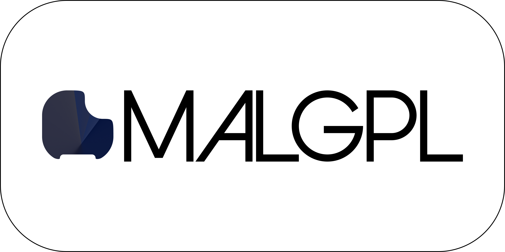

<p align="center">
  <a href="https://github.com/magayaga/MALGPL">
    
  </a>
</p>

<h1 align="center">MALGPL</h1>

**MALGPL**, short for the **Magayagaian Algorithmic Programming Language** is an imperative, reflective, generic, array, and meta-programming language.  It was designed and developed by [Cyril John Magayaga](https://github.com/magayaga), best known as the original author and developer of the **Hyzero**, **Xenly**, **BINPL**, and **LibreBASIC** programming languages.

MALGPL is influenced by the **Fortran** programming language. Cyril wrote, “Fortran is the world’s first high-level programming language but it is the longest whole life of programming.”

### "Hello, World!" program

Here’s a simple program to print “Hello, World!” written in MALGPL programming language:

```basic
WRITE("Hello, World!")
```

and 

```basic
BEGIN
    COMMENT “Hello, World!” program
    WRITE("Hello, World!")
END
```

It is similar to the “Hello, World!” program written in ALGOL 60 programming language:

```basic
BEGIN
    COMMENT “Hello, World!” program
    WRITE(“Hello, World!”)
END
```

## Copyright

Copyright (c) 2024 Cyril John Magayaga.
